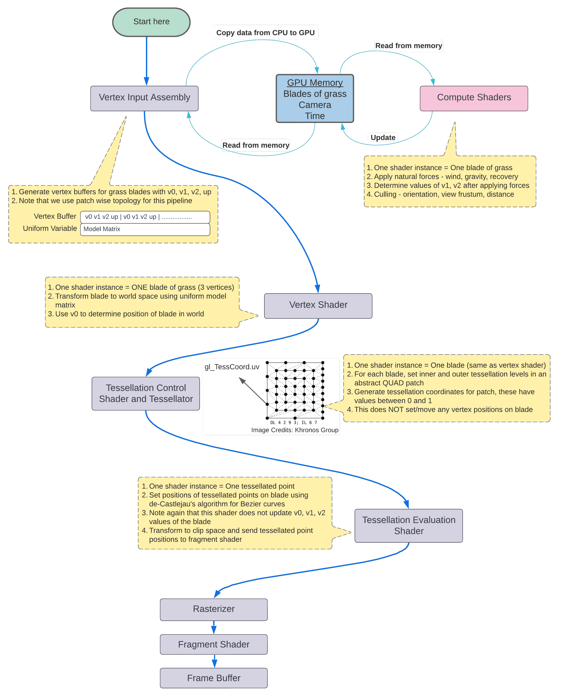
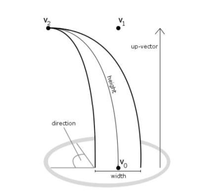
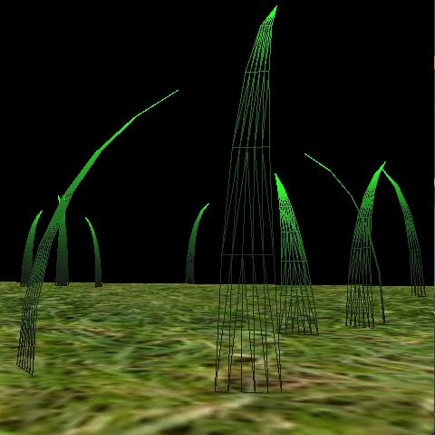
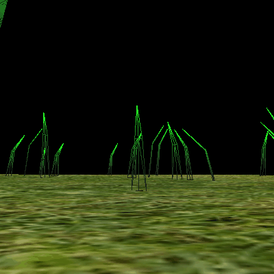
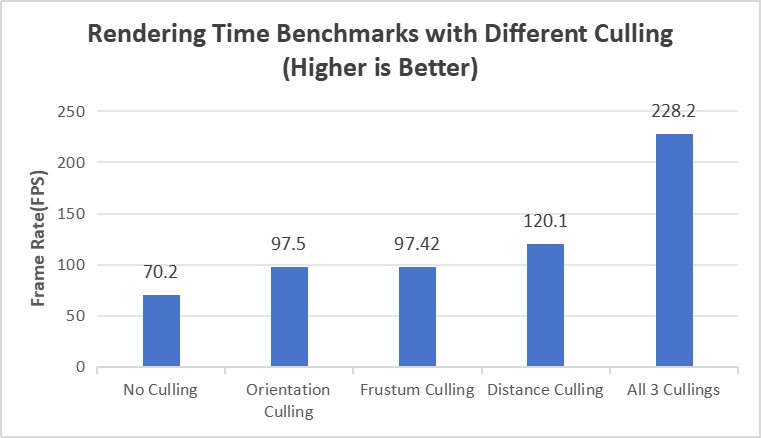
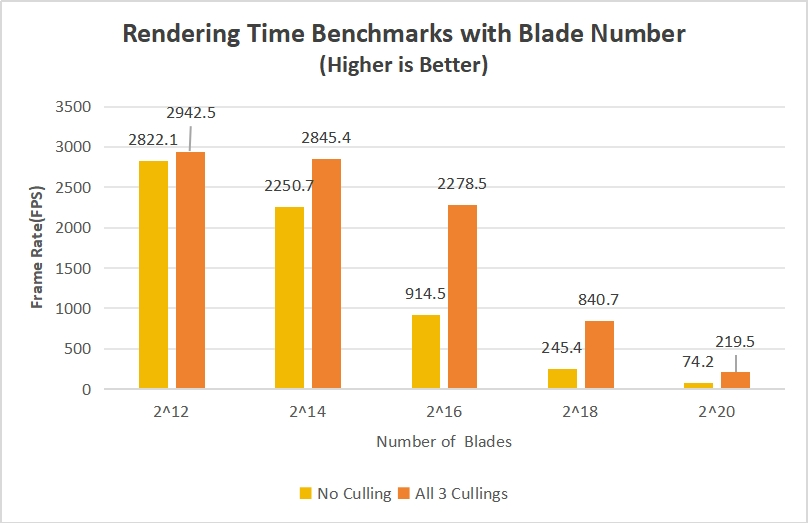

Vulkan Grass Rendering
==================================

**University of Pennsylvania, CIS 565: GPU Programming and Architecture, Project 5**

* Jichu Mao
  * [LinkedIn](https://www.linkedin.com/in/jichu-mao-a3a980226/)
  *  [Personal Website](https://jichu.art/)
* Tested on: Windows 11,  i7-13700K @ 3.40 GHz, 32GB, RTX 4090 24GB

## Overview

In this project, a grass simulator and renderer is implemented using the Vulkan API, leveraging advanced shader techniques for both physics simulation and rendering optimization. Each blade of grass is represented by a Bézier curve, with tessellation shaders utilized to simulate realistic physics. Physics calculations incorporate various natural forces — environmental gravity, wind, and self-recovery — applied through a compute shader to create an organic, lifelike appearance.

To enhance rendering efficiency, a compute shader is employed to cull grass blades that are not visible or do not contribute significantly to the current frame, reducing the workload on the GPU. The remaining visible blades are processed through a graphics pipeline, where the vertex shader manipulates Bézier control points, the tessellation shaders dynamically generate grass geometry, and the fragment shader applies Lambertian shading to realistically color the grass blades.

This implementation is inspired by the techniques outlined in the paper [Responsive Real-Time Grass Rendering for General 3D Scenes](https://www.cg.tuwien.ac.at/research/publications/2017/JAHRMANN-2017-RRTG/JAHRMANN-2017-RRTG-draft.pdf) by Jahrmann and Wimmer..

## Showcase

|  |
|:--:|
| ***213 Grass Blades with dynamic tesselation levels*** |

## Pipeline Overview
This project leverages a Vulkan-based pipeline to simulate and render realistic grass. The diagram below provides a detailed breakdown of the various components built within the pipeline to achieve this.

|  |
|:--:|
| *Figure 2. Vulkan Pipeline Diagram* |

In this project, we are provided with a foundational Vulkan setup, which includes a compute pipeline for running compute shaders and two distinct graphics pipelines: one for rendering the terrain geometry and another specifically for grass rendering. Our primary focus is to develop the shaders required for the grass rendering pipeline (`grass.vert`, `grass.tesc`, `grass.tese`, and `grass.frag`) and the compute pipeline (`compute.comp`). Additionally, necessary resources (descriptors) are bound to facilitate these tasks within the pipeline.

The following diagram shows clearly the workflow at different stages of the Vulkan pipeline in order to render and simulate realistic grass. *(Diagram credits from [Rhuta Joshi](https://github.com/rcj9719/gpu-vulkan-grass-rendering/))*
|  |
|:--:|
| *Figure 3. Project Pipeline Diagram* |

## The Physical Grass Model - Blade
In this project, grass blades will be represented as Bezier curves while performing physics calculations and culling operations (Figure 4). 

Each Bezier curve has three control points.
* `v0`: the position of the grass blade on the geomtry
* `v1`: a Bezier curve guide that is always "above" `v0` with respect to the grass blade's up vector (explained soon)
* `v2`: a physical guide for which we simulate forces on

We also need to store per-blade characteristics that will help us simulate and tessellate our grass blades correctly.
* `up`: the blade's up vector, which corresponds to the normal of the geometry that the grass blade resides on at `v0`
* Orientation: the orientation of the grass blade's face
* Height: the height of the grass blade
* Width: the width of the grass blade's face
* Stiffness coefficient: the stiffness of our grass blade, which will affect the force computations on our blade

We pack all this data into four `vec4`s, such that `v0.w` holds orientation, `v1.w` holds height, `v2.w` holds width, and `up.w` holds the stiffness coefficient.

|  |
|:--:|
| *Figure 4. Illustration of the definition of a blade of grass* |

More than that, we also apply **Gravity**, **Recovery** and **Wind Force** onto the blades in order to creating an nartural movement.

The compute shader `compute.comp` operates on each blade individually, calculating the influence of various forces on each blade and updating the positions of control points v0, v1, and v2 every frame. Additionally, it handles culling operations, which are detailed in a later section.

## Tessellation

As previously mentioned in pipleline overview, we will implement the tessellation control shader in `grass.tesc` and the tessellation evaluation shader in `grass.tese`.

### Geometry Generation Using Tessellation Shaders
With each grass blade represented by a Bézier curve, we use tessellation shaders to generate a triangulated mesh, optimizing for both detail and performance within the graphics pipeline.

Tessellation involves subdividing vertex data patches into finer primitives. The pipeline comprises the Tessellation Control Shader (TCS), a fixed-function Primitive Generator (PG), and the Tessellation Evaluation Shader (TES). Our TCS (`grass.tesc`) processes patches of three control points for each blade and sets tessellation levels to control subdivision density. We define quads as our patch domain in the TES (`grass.tese`), which determines the final vertex positions using De Casteljau’s algorithm. The tessellated quads are then remapped into triangular shapes to better resemble grass blades, as illustrated in Figure 5.

|  |
|:--:|
| *Figure 5. Triangles remapped from quads* |

### Level of Detail (LOD) Control
To manage Level of Detail (LOD), tessellation levels are adjusted based on each blade’s distance from the camera, allowing for finer detail in closer blades while conserving resources for those farther away. This dynamic approach effectively balances visual quality and performance, highlighting the versatility of tessellation shaders in real-time rendering, as illustrated in Figure 6.

|  |
|:--:|
| *Figure 6. Tessellation with LOD control* |

## Optimization - Culling Techniques
To optimize rendering performance, we implement three distinct types of culling as described in the reference paper. These methods selectively discard grass blades that do not contribute significantly to the scene, thus enhancing efficiency:

### Orientation Culling
 Grass blades with a forward vector that is nearly perpendicular to the camera’s view vector (resulting in minimal visible width) are culled. This feature can be enabled with the `ORIENTATION_CULLING` preprocessor directive in `compute.comp`.

|  |
|:--:|
| *Figure 7. Orientation Culling* |

### View-Frustum Culling
 Grass blades positioned outside the viewing frustum are discarded. This feature is controlled by the `FRUSTUM_CULLING` directive in compute.comp. The tolerance for this culling method can be adjusted via the tolerance parameter within the compute shader, allowing for fine-tuning.

|  |
|:--:|
| *Figure 8. View-Frustum Culling* |

### Distance Culling
Grass blades beyond a certain threshold distance are culled to reduce rendering costs, particularly for small, distant blades that contribute minimally to visual quality. This feature can be activated using the `DISTANCE_CULLING` preprocessor directive in `compute.comp`.

|  |
|:--:|
| *Figure 9. Distance Culling* |

Each of these culling techniques is selectively applied to achieve an efficient rendering pipeline, optimizing the balance between visual fidelity and performance.

## Performance Analysis

In this analysis, we assess the effectiveness of various culling techniques in optimizing frame rate (FPS) and evaluate performance under different numbers of grass blades. All tests use a tessellation level of 8, with consistent configuration parameters for each culling method.

### Impact of Culling Techniques
The first chart illustrates the FPS impact of each individual culling method and their combined effect. Testing with 2^15 grass blades, we find that:

- **Orientation Culling** and **Distance Culling** both deliver a noticeable FPS improvement, achieving frame rates of 97.5 FPS and 120.1 FPS, respectively, compared to the baseline of 70.2 FPS with no culling. This demonstrates that blades with limited visibility or those far from the camera can be efficiently removed from processing, reducing computational load.

- **View-Frustum Culling**, in this scenario, offers minimal or even negligible benefits, as most grass blades remain within the camera’s view frustum, leading to minimal culling. As a result, the extra computation required for frustum checks can even reduce efficiency slightly.

- **Combined Culling (All Three Techniques)** achieves the highest performance gain, reaching 228.2 FPS, a substantial improvement over any single method. This indicates that integrating multiple culling strategies is highly effective, maximizing the number of blades culled across diverse conditions.

### Effect of Blade Count on Rendering Performance
The second chart examines FPS variation across different grass blade counts, comparing scenarios with no culling and with all three culling techniques enabled.

- **Performance Decrease with Increased Blade Count**: As expected, the FPS consistently decreases with an increasing number of blades. Rendering all blades without any culling shows a steep decline in performance, from 2,822.1 FPS at 2^12 blades to just 74.2 FPS at 2^20 blades.

- **Performance Gains with Culling Enabled**: When all three culling methods are applied, significant performance improvements are observed, particularly as blade count rises. For example, at 2^16 blades, FPS increases from 914.5 to 2,278.5 with culling, highlighting the effectiveness of culling in reducing GPU load as scene complexity increases.

- **Performance Plateau at High Blade Counts**: As the number of blades reaches higher levels (e.g., 2^20), the culling methods still offer a performance boost (219.5 FPS compared to 74.2 FPS without culling), but the absolute gains diminish. This plateau effect suggests that beyond a certain threshold, the system’s ability to handle additional grass blades is limited by other bottlenecks, possibly memory bandwidth or CPU-GPU synchronization overhead.

In summary, the integration of orientation, frustum, and distance culling significantly enhances rendering performance, especially in complex scenes with high blade counts. The combined approach yields the best results, with distance and orientation culling providing the most consistent gains individually. 

## References

* [Responsive Real-Time Grass Grass Rendering for General 3D Scenes](https://www.cg.tuwien.ac.at/research/publications/2017/JAHRMANN-2017-RRTG/JAHRMANN-2017-RRTG-draft.pdf)
* [CIS565 Vulkan samples](https://github.com/CIS565-Fall-2017/Vulkan-Samples/tree/master/samples/5_helloTessellation)
* [Official Vulkan documentation](https://www.khronos.org/registry/vulkan/)
* [Vulkan tutorial](https://vulkan-tutorial.com/)
* [RenderDoc blog on Vulkan](https://renderdoc.org/vulkan-in-30-minutes.html)
* [Tessellation tutorial](https://ogldev.org/www/tutorial30/tutorial30.html)